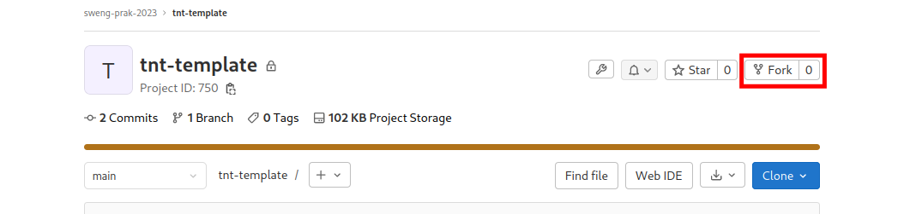
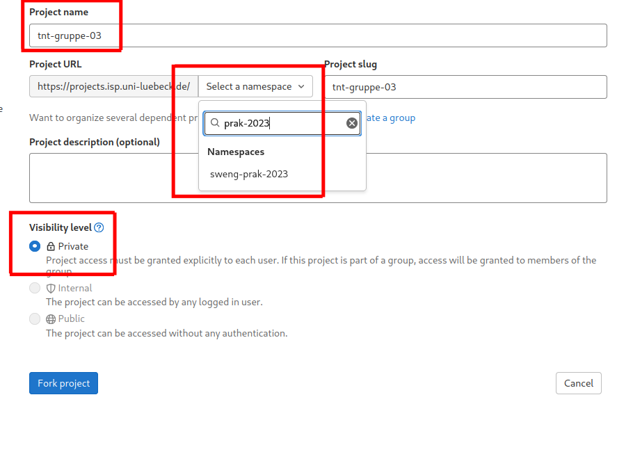
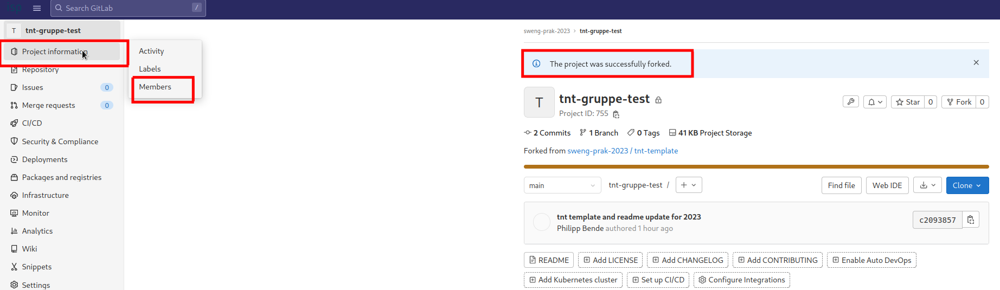
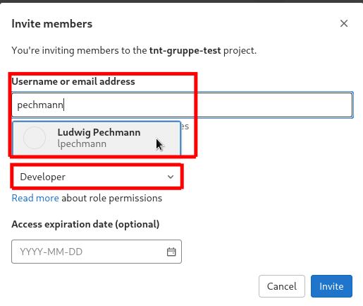
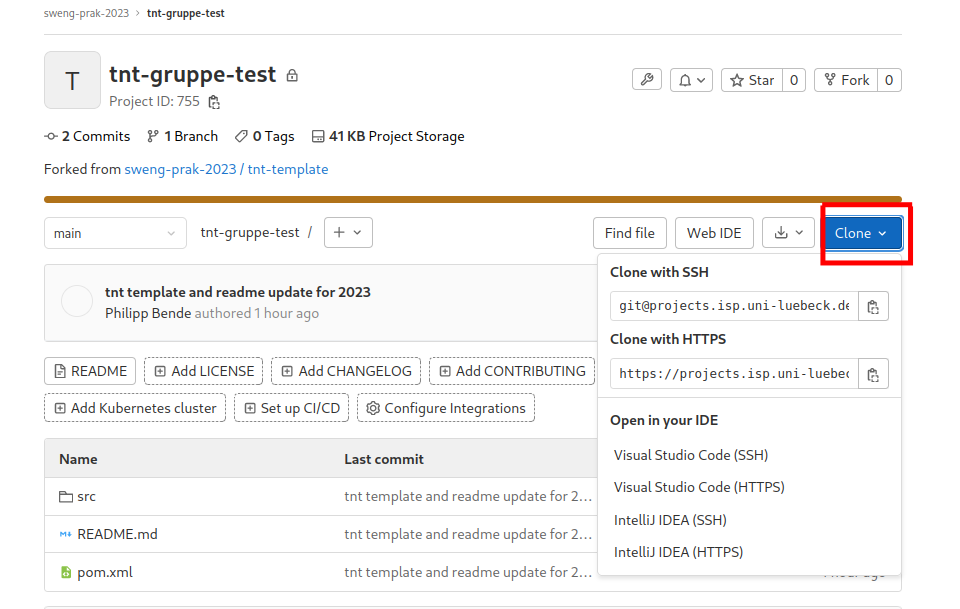

# Einrichtung Git

Für die Entwicklung der Software im Praktikum nutzen wir Gitlab zur Versionierung (projects.isp.uni-luebeck.de). In diesem Gitlab sind Tutorials, Templates und Informationen zum Praktikum zur Verfügung gestellt. Die Benutzung des Gitlabs ist während des Praktikums verpflichtend und fließt auch mit in die Bewertung ein.

Falls noch kein Account vorhanden ist, bitte unter **https://projects.isp.uni-luebeck.de** registrieren. Die Accounts müssen manuell freigeschaltet werden. Daher bitte für den Accountnamen **vorname.nachname** und als E-Mail-Adresse die Uni-Mail benutzen (...@student.uni-luebeck.de) 

# Template

Für das Praktikum wird ein Template bereitgestellt, in dem die Code-Struktur, Maven pom.xml, etc. bereits vorgegeben ist. 

Das Template befindet sich unter: 
https://projects.isp.uni-luebeck.de/sweng-prak-2023/tnt-template

## Fork des Templates

Jede Gruppe muss **einen** Fork des Templates anlegen. 
Dazu klickt man auf den Button Fork (1)

Anschließend müssen Projekt Name, Namespace und Zugriffsrechte festgelegt werden. (2)
Der Name muss **tnt-gruppe-xx** lauten.
Der Namespace muss **sweng-prak-2023** sein (die Gruppe existiert bereits und muss **nicht** selbst angelegt werden).
Für **Visibility Level** sollte **Private** ausgewählt werden.

## Einladung aller Teammitglieder

Nach dem Erfolgreichen Fork müssen alle Teammitglieder in dieses Projekt eingeladen werden. Dazu gibt es die Option in **Project Management -> Members** (3)

Dann können durch Klicken auf **Invite members** Teammitglieder hinzugefügt werden.
Bitte beachtet, dass nur im Gitlab registrierte und freigeschaltete Nutzer hinzugefügt werden können.
Unter **Select a Role** sollte wenigstens **Developer** für alle Teammitglieder ausgewählt werden. (Maintainer / Owner wäre auch OK) (4)

## Clonen des Projekts

Um an dem Projekt zu arbeiten, sollten jetzt alle Teammitglieder das Projekt clonen (auf den Pool-PCs bzw. private Rechnern) (5)

